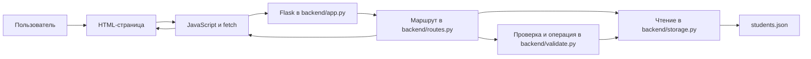

# Полная методичка по лабораторной работе №2

**Тема:** серверное REST API для учёта студентов общежития.  
**Технологии:** Python, Flask, HTML, CSS, JavaScript, JSON.  
**Рядом с этой методичкой:** [ответы на 18 вопросов](answers_lab2.md).

Эта методичка описывает **текущую реализацию проекта**, а не абстрактный пример. После чтения ты должен уметь объяснить, какой файл за что отвечает, что происходит при каждом действии пользователя и почему сервер возвращает конкретный HTTP-код.

## 1. Задача лабораторной простыми словами

Есть список студентов общежития. Пользователь должен уметь:

1. Увидеть всех студентов и отфильтровать список.
2. Открыть карточку одного студента по ИСУ.
3. Добавить студента.
4. Изменить часть данных существующего студента.
5. Удалить студента.

В первой лабораторной такие действия могли выполняться в браузере. Во второй лабораторной источник данных и правила проверки находятся **на сервере**. Браузер отправляет запрос, сервер выполняет действие и возвращает результат. Поэтому нельзя открывать `index.html` как `file://...`: нужно открыть страницу через Flask по адресу `http://127.0.0.1:5000/`.

## 2. Как запустить проект

Из папки проекта:

```bash
python3 -m venv .venv
source .venv/bin/activate
pip install -r requirements.txt
python backend/app.py
```

После запуска открыть `http://127.0.0.1:5000/`. Сервер запускается на порту 5000 в `backend/app.py:54`. Для остановки нажать `Ctrl+C` в терминале. Папка `.venv` — локальное окружение с установленным Flask; её не нужно включать в сдаваемый архив.

`requirements.txt` содержит зависимость от Flask. Сервер одновременно отдаёт HTML, CSS, JavaScript и API, поэтому запросы браузера идут на тот же адрес и порт.

## 3. Общая схема



**Важно понимать направление:** браузер не открывает `students.json` напрямую. Он знает только адреса API. Сервер читает файл, проверяет данные и формирует ответ.

### Что такое HTTP-запрос и ответ

Запрос состоит из метода (`GET`, `POST` и т. д.), адреса, при необходимости заголовков и тела. Например, создание студента — это `POST /api/requests` с заголовком `Content-Type: application/json` и JSON-телом. Ответ содержит HTTP-код и обычно JSON-данные. Код сообщает результат операции, а тело — данные или описание ошибки.

## 4. Карта файлов проекта

| Файл | Что делает | Куда смотреть |
|---|---|---|
| `backend/app.py` | Создаёт Flask-приложение, подключает API, отдаёт страницы и файлы, обрабатывает общие ошибки | строки 7–54 |
| `backend/routes.py` | Объявляет маршруты API, принимает HTTP-запрос и формирует ответ | строки 5–86 |
| `backend/validate.py` | Проверяет значения и фильтры, выполняет операции со студентами и проверяет уникальность ИСУ | строки 6–146 |
| `backend/storage.py` | Читает и записывает JSON-файл, выполняет поиск и изменение списка | строки 4–63 |
| `index.html` | Таблица студентов и форма фильтров | строки 21–86 |
| `form.html` | Форма создания и редактирования | строки 14–100 |
| `student.html` | Карточка студента | строки 14–35 |
| `js/storage.js` | Общая функция `fetch` и вызовы методов API | строки 1–56 |
| `js/index.js` | Загрузка таблицы, фильтры, переходы и удаление | строки 1–128 |
| `js/form.js` | Загрузка студента в форму, проверка формы, создание или изменение | строки 1–123 |
| `js/student.js` | Загрузка и показ карточки | строки 1–25 |
| `css/styles.css` | Внешний вид и адаптация под узкий экран | весь файл |

### Почему файлы разделены

Маршрут отвечает за HTTP: получает запрос, вызывает нужную функцию и формирует ответ с кодом. `backend/validate.py` проверяет допустимость значений и фильтров, а также выполняет создание, изменение и удаление студентов с проверкой существования записи и уникальности ИСУ. `backend/storage.py` загружает список и сохраняет изменения. Все Python-файлы лежат в папке `backend`; `students.json` остаётся в корне проекта. Зависимости идут так: `backend/app.py` → `backend/routes.py` → `backend/validate.py` → `backend/storage.py`. Для чтения списка или одного студента маршрут обращается к `backend/storage.py` напрямую.

## 5. Модель студента

Студент хранится как JSON-объект. В Python после чтения JSON это словарь `dict`:

```json
{
  "name": "Иван Иванов",
  "group": "M3301",
  "isu": 123456,
  "dorm": 8,
  "room": "101",
  "expDate": "2027-06-01",
  "foreigner": false,
  "notes": ""
}
```

| Поле | Значение | Проверка на сервере |
|---|---|---|
| `name` | ФИО | Непустая строка минимум из двух слов; разрешены латинские и русские буквы и пробельные символы (`backend/validate.py:16`) |
| `group` | Учебная группа | Латинская буква и четыре цифры; первая цифра от 1 до 9 (`backend/validate.py:25`) |
| `isu` | Уникальный ИСУ ID | Целое число от 100000 до 999999; не должен повторяться (`backend/validate.py:30`, `backend/validate.py:113`) |
| `dorm` | Номер общежития | Целое число от 1 до 100 (`backend/validate.py:37`) |
| `room` | Номер комнаты | От двух до четырёх цифр и необязательная буква (`backend/validate.py:44`) |
| `expDate` | Дата окончания заселения | Дата, которую может разобрать `date.fromisoformat` (`backend/validate.py:49`) |
| `foreigner` | Иностранный студент | Логическое значение `true` или `false` (`backend/validate.py:57`) |
| `notes` | Заметки | Строка, необязательное поле (`backend/validate.py:60`) |

При `POST` обязательны все поля, кроме `notes` (`backend/validate.py:10`). При `PATCH` можно передать только изменяемые поля (`backend/validate.py:118`). Перед сохранением `isu` и `dorm` приводятся к целым числам (`backend/validate.py:111`, `backend/validate.py:128`).

**Тонкость:** HTML ограничивает заметки 500 символами, но сервер отдельно длину заметок не проверяет. Сервер проверяет корректность даты, но не применяет нижнюю границу `1990-01-01`, заданную в форме. На защите лучше описывать именно то, что делает код, без приписывания ему дополнительных проверок.

## 6. Какие адреса есть в API

| Метод и адрес | Действие | Успешный код | Где обработчик |
|---|---|---:|---|
| `GET /api/requests` | Получить список; можно добавить фильтры в URL | 200 | `backend/routes.py:36` |
| `GET /api/requests/<isu>` | Получить одного студента | 200 | `backend/routes.py:54` |
| `POST /api/requests` | Создать студента | 201 | `backend/routes.py:61` |
| `PATCH /api/requests/<isu>` | Частично изменить студента | 200 | `backend/routes.py:71` |
| `DELETE /api/requests/<isu>` | Удалить студента | 204 | `backend/routes.py:81` |
| `QUERY /api/requests` | Отфильтровать список по JSON-телу | 200 | `backend/routes.py:44` |

`<isu>` — переменная часть адреса. Например, в `/api/requests/123456` Flask преобразует её в целое число и передаёт функции как аргумент `isu`. Для списка путь один и тот же, а действие определяется HTTP-методом.

Название `/api/requests` задано ТЗ, хотя внутри этого API ресурсом фактически является студент. `QUERY` используется потому, что он отдельно указан в ТЗ; для обычной фильтрации работает и `GET` с параметрами.

## 7. Что происходит при открытии главной страницы

1. Браузер запрашивает `/`.
2. Flask вызывает `index()` в `backend/app.py:29` и отдаёт `index.html`.
3. Браузер загружает `css/styles.css`, `js/storage.js` и `js/index.js` через маршруты `backend/app.py:41` и `backend/app.py:45`.
4. В конце `js/index.js:128` вызывается `showStudents()`.
5. Эта функция вызывает `getStudents()` из `js/storage.js:21`.
6. Браузер отправляет `GET /api/requests`.
7. Flask вызывает `get_students()` в `backend/routes.py:37`. Маршрут проверяет фильтры через `checked_filters()` (`backend/routes.py:21`).
8. Без фильтров маршрут вызывает `storage.get_all()`, которая читает `students.json` (`backend/storage.py:19`). С фильтрами вызывает `storage.filter_students()` (`backend/routes.py:41`). Если файла ещё нет, получается пустой список (`backend/storage.py:7`).
9. `jsonify(students)` создаёт JSON-ответ с кодом `200`.
10. `js/index.js:45` очищает таблицу и создаёт строки для полученных студентов. Если список пуст, показывает «Нет студентов».

В таблице значение `foreigner` превращается в понятный текст «Иностранец» или «Не иностранец» (`js/index.js:72`). Кнопки «Подробнее», «Редактировать» и «Удалить» добавляются для каждой строки (`js/index.js:85`).

## 8. Полный путь создания студента

1. Кнопка «Добавить студента» открывает `form.html` (`js/index.js:8`).
2. `js/form.js:49` считывает значения формы в объект JavaScript. ИСУ и общежитие преобразуются через `Number`, флажок становится `true` или `false`.
3. Браузер выполняет проверку формы через `form.reportValidity()` (`js/form.js:93`). Это быстрый способ показать ошибку пользователю, но **не замена серверной проверке**.
4. `addStudent()` отправляет `POST /api/requests` с JSON-телом (`js/storage.js:38`).
5. `backend/routes.py:63` через `json_object()` убеждается, что тело — непустой JSON-объект. Иначе возвращает `400`.
6. `validate.create_student()` вызывает `validate_student()` (`backend/validate.py:104`, `backend/validate.py:6`). Если значения неверны, возвращает словарь ошибок и статус `422`; маршрут формирует JSON-ответ (`backend/routes.py:66`).
7. Функция проверяет, что ИСУ ещё не занят (`backend/validate.py:113`). При дубликате возвращает статус `409`, который маршрут передаёт клиенту (`backend/routes.py:28`).
8. `storage.add()` загружает текущий список, добавляет словарь и записывает список в `students.json` (`backend/storage.py:31`).
9. API возвращает сохранённого студента и `201 Created` (`backend/routes.py:69`).
10. Браузер переходит обратно к таблице (`js/form.js:105`), которая заново загружает данные с сервера.

Форма имеет атрибут `novalidate` (`form.html:15`): автоматическая браузерная проверка при отправке отключена, потому что JavaScript сам вызывает `reportValidity()` после установки пользовательских сообщений.

## 9. Просмотр, обновление и удаление

### Просмотр карточки

Кнопка «Подробнее» открывает `student.html?isu=123456` (`js/index.js:89`). Скрипт читает `isu` из адреса и отправляет `GET /api/requests/123456` (`js/student.js:3`, `js/storage.js:34`). Маршрут напрямую вызывает `storage.get_by_isu()` (`backend/routes.py:56`, `backend/storage.py:23`). Если записи нет, он возвращает JSON-ошибку `404` (`backend/routes.py:58`).

### Частичное обновление

Кнопка «Редактировать» открывает форму с ИСУ в адресе (`js/index.js:93`). Форма сначала загружает текущие значения (`js/form.js:18`). При сохранении она отправляет `PATCH /api/requests/<старый-isu>` (`js/form.js:98`). Маршрут вызывает `validate.update_student()` (`backend/routes.py:76`, `backend/validate.py:118`); функция проверяет существование и только присланные поля, затем вызывает `storage.update()`. Там `s.update(updates)` меняет поля словаря (`backend/storage.py:38`). Поэтому API допускает запрос только с одним изменённым полем, например `{"room":"102"}`.

Если меняется сам ИСУ, сервер сначала проверяет, что новый номер свободен (`backend/validate.py:132`). Старый ИСУ в адресе нужен, чтобы найти исходную запись. Пустое тело `PATCH` отвергается кодом `400`.

### Удаление

Кнопка «Удалить» сначала спрашивает подтверждение (`js/index.js:101`), затем отправляет `DELETE /api/requests/<isu>` (`js/storage.js:54`). Маршрут вызывает `validate.delete_student()`; функция проверяет существование записи и вызывает удаление в хранилище (`backend/routes.py:83`, `backend/validate.py:142`, `backend/storage.py:48`). Успех — `204 No Content`, то есть **без тела ответа**. Если записи нет, маршрут возвращает `404`.

## 10. Как работает фильтрация

Форма фильтров находится на главной странице (`index.html:24`). При нажатии «Найти» `js/index.js:12` собирает только заполненные поля в объект `activeFilters`. Если условий не больше трёх, `js/storage.js:21` создаёт адрес вида:

```text
GET /api/requests?group=M3301&dormitory=8
```

Если условий больше трёх, клиент отправляет `QUERY /api/requests` и помещает фильтры в JSON-тело. Порог «три» выбран в коде, чтобы не создавать длинный URL; это не правило протокола HTTP.

На сервере маршрут передаёт условия в `validate.normalize_filters()` (`backend/routes.py:21`, `backend/validate.py:69`). Эта функция проверяет названия и типы. Имя `dormitory` из примера ТЗ преобразуется в поле модели `dorm` (`backend/validate.py:74`). Строка `false` для фильтра `foreigner` превращается в логическое значение `False` (`backend/validate.py:84`). Затем маршрут вызывает `storage.filter_students()` (`backend/storage.py:57`), которая оставляет записи, у которых **все** условия совпадают. Сравнение точное: `name=Иван` не найдёт запись с ФИО `Иван Иванов`.

Кнопка «Сбросить» очищает условия и повторно загружает полный список (`js/index.js:20`). Неизвестное или неверно заданное свойство фильтра даёт `422`; неверное JSON-тело `QUERY` даёт `400`.

## 11. Коды ответа и единый формат ошибок

| Код | Когда встречается в этом проекте |
|---:|---|
| 200 | Список, карточка, результат фильтрации или обновлённый студент |
| 201 | Студент создан |
| 204 | Студент удалён; тело ответа пустое |
| 400 | Нет нужного JSON-тела или тело неверной формы |
| 404 | Студент или API-адрес не найден |
| 409 | ИСУ уже занят |
| 422 | Данные студента или фильтр не прошли проверку |
| 500 | Неожиданная серверная ошибка, например повреждённый JSON-файл |

Ошибки API создаются функцией `error_response()` (`backend/routes.py:8`). Функции в `backend/validate.py` возвращают ошибку и HTTP-код, а `student_error()` в `backend/routes.py:28` превращает их в единый JSON-ответ. Формат ответа:

```json
{
  "error": {
    "message": "Некорректные данные студента",
    "details": {
      "isu": "ИСУ должен быть от 100000 до 999999"
    }
  }
}
```

`message` — общее сообщение, `details` — ошибки конкретных полей или пустой объект. Общие HTTP-ошибки и ошибка `500` обрабатываются в `backend/app.py:13` и `backend/app.py:20`. Браузер проверяет `response.ok` и показывает сообщение или ошибку поля (`js/storage.js:11`, `js/form.js:106`). Для `204` клиент не пытается разбирать JSON, потому что у ответа нет тела (`js/storage.js:11`).

## 12. Как устроено хранение

`backend/storage.py:4` задаёт путь к `students.json` в корне проекта, на уровень выше папки `backend`, поэтому местоположение базы не зависит от того, из какой директории запустили Python. Если файла ещё нет, `load_data()` возвращает пустой список. При сохранении весь список перезаписывается в JSON с отступами и читаемыми русскими буквами (`backend/storage.py:14`).

Это простая учебная схема:

```text
JSON-файл → список словарей Python → изменение списка → новый JSON-файл
```

Операция поиска просматривает список, сравнивая `isu` (`backend/storage.py:23`). При удалении создаётся новый список без нужного студента (`backend/storage.py:48`). Для небольшой лабораторной это понятно и достаточно. Для большой нагрузки файл неудобен: каждый запрос читает весь список, запись перезаписывает весь файл, а параллельные изменения без блокировки могут конфликтовать. В такой системе обычно переходят к базе данных и механизмам согласованной записи.

## 13. Stateless и граница между клиентом и сервером

**Stateless** означает, что для обработки нового HTTP-запроса серверу не нужно помнить предыдущий запрос конкретного браузера. Все необходимые сведения находятся в URL, методе, параметрах или JSON-теле. Например, `PATCH /api/requests/123456` указывает, кого изменить, а тело указывает, что изменить.

Это не означает, что сервер ничего не хранит: `students.json` — постоянные общие данные. В браузере есть временное состояние интерфейса (`activeFilters` в `js/index.js:6`) и введённые в форму значения. Список студентов как источник истины хранится на сервере. Серверная проверка остаётся обязательной, потому что сторонний клиент может вызвать API без HTML-формы.

## 14. Практика: попробовать API вручную

Сначала запусти сервер. В другом терминале можно выполнить следующие команды. Они **изменяют `students.json`**, поэтому для демонстрации используй новый ИСУ и при необходимости удали созданную запись.

### Получить весь список

```bash
curl -i http://127.0.0.1:5000/api/requests
```

### Создать студента

```bash
curl -i -X POST http://127.0.0.1:5000/api/requests \
  -H 'Content-Type: application/json' \
  -d '{"name":"Иван Иванов","group":"M3301","isu":123456,"dorm":8,"room":"101","expDate":"2027-06-01","foreigner":false,"notes":""}'
```

Ожидаемый код — `201`. Повторение той же команды должно дать `409`, поскольку ИСУ обязан быть уникальным.

### Найти студента и отфильтровать список

```bash
curl -i http://127.0.0.1:5000/api/requests/123456
curl -i 'http://127.0.0.1:5000/api/requests?group=M3301&dormitory=8'
```

Оба запроса должны дать `200`. Для `QUERY`:

```bash
curl -i -X QUERY http://127.0.0.1:5000/api/requests \
  -H 'Content-Type: application/json' \
  -d '{"group":"M3301","dormitory":8,"room":"101","foreigner":false}'
```

### Изменить и удалить

```bash
curl -i -X PATCH http://127.0.0.1:5000/api/requests/123456 \
  -H 'Content-Type: application/json' \
  -d '{"room":"102"}'
curl -i -X DELETE http://127.0.0.1:5000/api/requests/123456
```

Ожидаемые коды — `200` и `204`. После удаления `GET /api/requests/123456` должен вернуть `404`.

## 15. Как показать работу преподавателю

1. Запусти сервер и открой `http://127.0.0.1:5000/`.
2. Покажи пустой список или уже сохранённые записи.
3. Добавь студента через форму. Открой `students.json` и покажи, что запись появилась на сервере.
4. Открой карточку студента и объясни path-параметр ИСУ.
5. Измени комнату и покажи обновлённую запись.
6. Примени два фильтра и покажи параметры в адресе запроса; затем четыре фильтра и объясни `QUERY`.
7. Попробуй повторить ИСУ при создании: объясни ошибку `409`.
8. Удали студента: объясни ответ `204` и последующий `404` при поиске.
9. Покажи папку `backend` и роли `backend/app.py`, `backend/routes.py`, `backend/validate.py`, `backend/storage.py`.

## 16. Что могут спросить сверх демонстрации

**Почему сервер проверяет данные, если форма уже проверяет?** Потому что API доступно и без формы. Только серверная проверка защищает правило для всех клиентов.

**Почему ИСУ — идентификатор?** Он указан в ТЗ как уникальный ID и входит в адрес отдельного ресурса. Проверка дубликатов находится в `backend/validate.py:113` и `backend/validate.py:132`.

**Почему `PATCH`, а не `POST` для редактирования?** `POST` создаёт ресурс в коллекции, а `PATCH` отправляет изменения уже существующего ресурса по его адресу.

**Почему после `DELETE` нет JSON?** Ответ `204 No Content` по смыслу не содержит тела. Это успешный результат удаления.

**Есть ли в проекте база данных?** Нет. Данные находятся в JSON-файле, что разрешено ТЗ. Python загружает файл в список словарей и записывает его обратно.

**Есть ли здесь Pydantic, dataclass, аннотации типов или асинхронный Python?** Нет. Это темы теоретических вопросов; проект использует словари, явную валидацию и синхронные Flask-обработчики. Асинхронный код есть в JavaScript-клиенте.

## 17. Ограничения текущей реализации

Полезно знать реальные ограничения и не обещать на защите того, чего код не делает:

- Фильтрация использует точное совпадение, без поиска по части имени или заметки.
- Данные сохраняются целым JSON-файлом без блокировок; одновременные записи нескольких пользователей могут конфликтовать.
- Сервер проверяет тип заметок, но не ограничивает их длину 500 символами; это ограничение есть только в HTML-форме.
- Сервер проверяет корректность даты, но не повторяет установленную в браузере нижнюю границу `1990-01-01`.
- Код не отклоняет все неизвестные дополнительные поля в JSON студента. Это следствие использования словаря без строгой модели.

Эти ограничения не мешают объяснить учебную архитектуру, но важно отличать уже реализованное поведение от возможных улучшений.

## 18. Одноминутное объяснение проекта

> Это приложение для учёта студентов общежития. Интерфейс написан на HTML и JavaScript, сервер — на Flask. Браузер отправляет серверу HTTP-запросы, а сервер проверяет данные и сохраняет их в JSON-файле. API поддерживает получение списка и отдельного студента, создание, частичное изменение, удаление и фильтрацию. Уникальный ключ студента — ИСУ. Все Python-файлы лежат в `backend`: `backend/routes.py` содержит HTTP-маршруты, `backend/validate.py` — проверку и операции со студентами, `backend/storage.py` — работу с JSON-файлом. При успехе и ошибках сервер возвращает соответствующие HTTP-коды, а ошибки API — в едином JSON-формате.

Для подготовки к устным вопросам используй эту методичку вместе с файлом [answers_lab2.md](answers_lab2.md).
